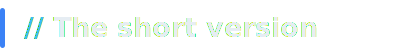
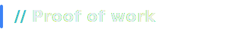

<!-- ═══════════════════════ BANNER ═══════════════════════ -->

<!-- ═══════════════════════ TYPING INTRO ═══════════════════════ -->

  

  
  <a href="#"> <!-- TODO: paste your LinkedIn URL here -->
    
  </a>
  <a href="mailto:youremail@example.com"> <!-- TODO: paste your email here -->
    
  </a>
  

 

<!-- ═══════════════════════ SHORT VERSION ═══════════════════════ -->

 

  
  &nbsp;&nbsp;
  

 

<!-- ═══════════════════════ ARSENAL ═══════════════════════ -->

 

  

 

<!-- ═══════════════════════ PROOF OF WORK ═══════════════════════ -->

  
  

  

 

  

<!--
Optional: a "snake eating your contributions" animation.
Set up the generator workflow at https://github.com/Platane/snk in your profile repo
(KunalKashyap12/KunalKashyap12), then uncomment the block below.
-->

 

  <picture>
    <source media="(prefers-color-scheme: dark)" srcset="https://raw.githubusercontent.com/KunalKashyap12/KunalKashyap12/output/github-snake-dark.svg" />
    <source media="(prefers-color-scheme: light)" srcset="https://raw.githubusercontent.com/KunalKashyap12/KunalKashyap12/output/github-snake.svg" />
    
  </picture>

 

<!-- ═══════════════════════ FOOTER ═══════════════════════ -->

 

<em>"Continuous learning, Continuous deployment."</em>

  

